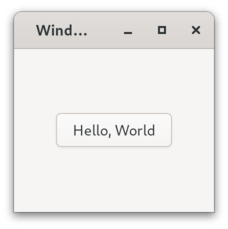

# Zig GIR FFI

GObject Introspection for zig. Generated [GTK4 binding](https://github.com/DerryAlex/zig-gir-ffi/releases) can be downloaded.

> **Warning**
> Only pre-releases targeting zig 0.x and 0.(x-1) are guarenteed to be kept.

###### Table of Contents

- [Usage](#usage)

- [Usage of Bindings](#usage-of-bindings)

- [Contributing](#contributing)

## Usage

```bash
# generate bindings for Gtk
zig build run -- -N Gtk
# generate bindings for Gtk-3.0
zig build run -- -N Gtk -V 3.0
# display help
zig build run -- --help
```

*Note*: This project relies on `field_info_get_size` to work properly.
Due to an [issue](https://gitlab.gnome.org/GNOME/gobject-introspection/-/issues/5) in gobject-introspection, a patched version of `g-ir-compiler` (or `gi-compile-repository`) may be required.
As bitfields are not commonly found in GIR files, users can use typelibs from their package manager (e.g., `apt`, `msys2`) without recompiling.
For notable exceptions (`glib`, `gobject` and `pango`), this project ships patched typelibs, which can be enabled by `--includedir lib/girepository-1.0` option.
For example, `zig build run -- -N Adw --includedir lib/girepository-1.0` should work perfectly if you have installed `gir1.2-adw-1` package or its equivalent.

## Usage of Bindings

Run `zig fetch --save https://url/to/bindings.tar.gz` and add the following lines to your `build.zig`. For more information, refer to [Zig Build System](https://ziglang.org/learn/build-system/).

```zig
const gtk = b.dependency("gtk4", .{});
exe.root_module.addImport("gtk", gtk.module("gtk"));
```

### Examples

- [application](examples/application) : Port of [Gtk - 4.0: Getting Started with GTK](https://docs.gtk.org/gtk4/getting_started.html), a relatively comprehensive example

- [hello](examples/hello) : A simple example  
  
  ```zig
  pub fn printHello() void {
    std.log.info("Hello World", .{});
  }
  pub fn activate(app: *GApplication) void {
    var window = ApplicationWindow.new(app.tryInto(Application).?).into(Window);
    window.setTitle("Window");
    window.setDefaultSize(200, 200);
    var box = Box.new(.vertical, 0);
    var box_as_widget = box.into(Widget);
    box_as_widget.setHalign(.center);
    box_as_widget.setValign(.center);
    window.setChild(box_as_widget);
    var button = Button.newWithLabel("Hello, World");
    _ = button.connectClicked(printHello, .{}, .{});
    _ = button.connectClicked(Window.destroy, .{window}, .{ .swapped = true });
    box.append(button.into(Widget));
    window.present();
  }
  pub fn main() u8 {
    var app = Application.new("org.gtk.example", .{}).into(GApplication);
    defer app.__call("unref", .{});
    _ = app.connectActivate(activate, .{}, .{});
    return @intCast(app.run(std.os.argv));
  }
  ```
  
  

- [clock](examples/clock) : (Implicit) use of the main context

- [custom](examples/custom) : Custom widget

- [interface](examples/interface) : Define interface

## Contributing

Read [docs/design.md](docs/design.md) and [docs/hacking.md](docs/hacking.md).
