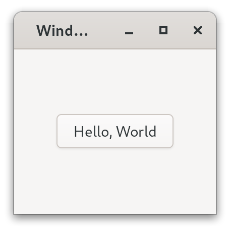
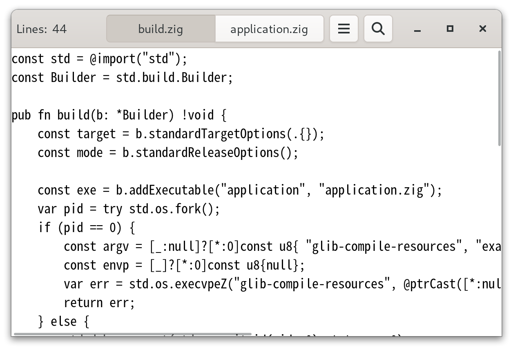

# Zig GIR FFI

GObject binding for ziglang using Introspection Repository

This repo targets GTK4, but should work for any `.gir` file.

The API should become more stable since v0.3.0.

## Documentation

- [Examples](./example/)
- [Docs](./docs/)
- [GTK Documentation](https://docs.gtk.org/)
- [Zig Language Reference](https://ziglang.org/documentation/master/)

## Screenshots of examples

[example1](./example/example1/)

[application](./example/application/)

